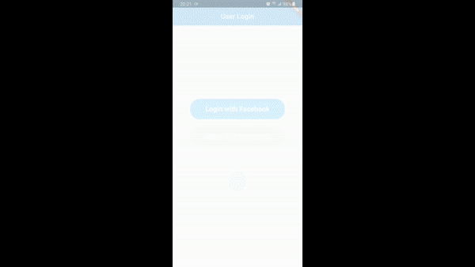

# HiringAssignment

A Flutter project that lets the user sign in via Facebook, or if previously logged in, user can sign via fingerprint authentication.
After sign in, user is displayed a map of their current location with a random route nearby. User can logout with logout button.

Get Current Location       |  Biometric Authentication |   
:-------------------------:|:-------------------------:|
  |   | 
